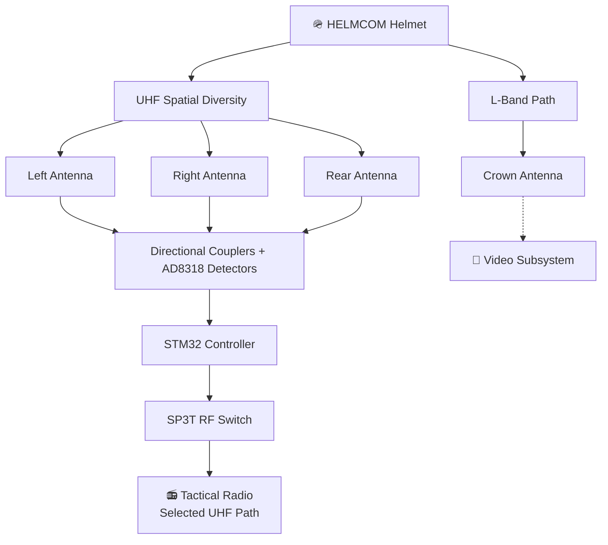

<div align="center">

# 🪖 HELMCOM

### Zero-Profile Adaptive Communication System

*Ditch the whip antenna. Let the helmet pick the best signal.*


</div>

---

## 📡 What is HELMCOM?

HELMCOM is a **helmet-mounted conformal antenna system** for tactical communication in **urban Close-Quarter Battle (CQB)** environments, where a protruding whip antenna snags, gets seen, and gets blocked.

We replace it with **low-profile antenna elements built into the helmet cover**. An **STM32** watches three UHF antenna paths and automatically switches to the strongest one. A separate **L-band antenna** is reserved for the video link.

> ⚠️ **Honest status:** antenna simulations and a bench-level switching demo are done. Physical RF hardware and end-to-end link testing are **not yet built**. See [Current Status](#-current-status).

---

## ✨ Key Features

| | Feature | Details |
|---|---|---|
| 🔀 | **3-element UHF spatial diversity** | Left, Right and Rear antenna paths |
| 🧠 | **Adaptive antenna selection** | STM32 compares signal strength and picks the best UHF path |
| 🎥 | **Dedicated L-band path** | Separate crown-mounted antenna for the video subsystem |
| 🧢 | **Conformal integration** | Flexible elements designed for the helmet cover |
| 🛡️ | **EBG/AMC shielding concept** | Aims to cut back-radiation toward the operator and push energy outward |
| 🔌 | **Low-profile interconnect** | Flexible coax to the radio/camera interface |

---

## 🏗️ System Architecture



---

## 🔁 How Adaptive Switching Works

```
UHF Antenna → Directional Coupler → AD8318 RF Detector → Analog RSSI Voltage
           → STM32 ADC → Signal Comparison → SP3T RF Switch → Selected Antenna
```

- **Receive-side sensing** of RF power on each path
- **Hysteresis / debounce** intended, to avoid needless flip-flopping
- **Switching inhibited during transmission**

---

## 📐 Antenna Design

### 1️⃣ UHF Meander Antenna (433 MHz target)

Compact meandered radiator designed in **CST Studio Suite**.

| Parameter | Value |
|---|---|
| Target frequency | 433 MHz |
| Substrate | LCP (εr = 2.9, tanδ = 0.0025) |
| Substrate thickness | 0.5 mm |
| Board footprint | ~76 × 76 mm |
| Meander rows | 12 |
| Segment length | 38 mm |
| Row pitch | 6 mm |
| Trace width | 2 mm |
| Copper thickness | 0.035 mm |
| Feed | 50 Ω discrete edge port |

**Current simulation results**

| Metric | Result |
|---|---|
| Resonance (flat model) | **~460 MHz** *(not yet 433 MHz)* |
| S11 at resonance | ~ −6.8 dB |
| Radiation efficiency @ 433 MHz | ~92 % |
| Directivity @ 433 MHz | ~1.92 dBi |
| Head/foam loading study | Resonance shifts to **~406 MHz** |

> 🔧 The UHF geometry is **still being tuned**. Head/foam loading shifts resonance significantly, so the final conformal design will need re-tuning.

### 2️⃣ L-Band Patch (1.575 GHz prototype)

Rectangular microstrip patch simulated in CST.

| Parameter | Value |
|---|---|
| Frequency | 1.575 GHz |
| Patch size | 55 × 69.1 mm |
| Substrate | LCP (εr = 2.8), 0.535 mm |
| Board size | 80 × 80 mm |
| Feed position | −13 mm |
| Feed width | 3 mm |

**Flat free-space results**

| Metric | Result |
|---|---|
| S11 | ≈ −21 dB |
| Z11 | ≈ 44 Ω |
| Directivity | ≈ 9.44 dBi |
| Radiation efficiency | ≈ −0.873 dB |
| Total efficiency | ≈ −1.281 dB |

> 📌 1.575 GHz is a **prototype frequency**. The final video-system frequency must be confirmed before this antenna is finalized.

---

## 🧪 Proteus Validation

Adaptive switching logic was validated at bench level in **Proteus VSM** on an **STM32F103C8T6**. Potentiometers stand in for the RF detector outputs.

### Pin Mapping

| Function | Component | STM32 Pin |
|---|---|---|
| Left RSSI | RV1 | PA0 / ADC0 |
| Right RSSI | RV2 | PA1 / ADC1 |
| Rear RSSI | RV3 | PA2 / ADC2 |
| Left path control | D1 | PB0 |
| Right path control | D2 | PB1 |
| Rear path control | D3 | PB10 |

### Test Results

| Test | Strongest Path | Result |
|---|---|---|
| RV1 highest | Left | ✅ PASS |
| RV2 highest | Right | ✅ PASS |
| RV3 highest | Rear | ✅ PASS |

The STM32 correctly compares the three analog inputs and activates **only** the matching antenna-select output.

> ℹ️ This validates **controller logic only**. It does **not** represent full RF performance, detector characteristics, RF-switch losses, or real antenna link performance.

---

## 🚦 Current Status

| Subsystem | Status |
|---|---|
| HELMCOM architecture | ✅ Defined |
| UHF CST model | 🟡 Completed, further tuning required |
| UHF conformal / loading study | 🟠 In progress |
| L-band flat CST model | ✅ Validated at 1.575 GHz |
| L-band curved model | 🟠 In progress |
| STM32 adaptive logic | ✅ Validated in Proteus |
| Physical RF switch | ⬜ Not yet integrated |
| Physical AD8318 sensing | ⬜ Not yet integrated |
| Complete helmet prototype | ⬜ Future work |
| End-to-end RF / link testing | ⬜ Future work |

---

## 🗺️ Roadmap

- [ ] Tune the UHF antenna to the actual radio operating frequency
- [ ] Finalize helmet curvature and head/foam loading model
- [ ] Complete the conformal L-band simulation
- [ ] Fabricate antenna prototypes and measure with a VNA
- [ ] Integrate real RF detectors and the SP3T switch
- [ ] Validate adaptive switching with real RF signals
- [ ] Test the full helmet system against a conventional whip-antenna baseline

---

## 📁 Repository Structure

```
HELMCOM/
├── README.md
├── CST/
│   ├── UHF_433MHz_Meander/
│   └── LBand_1.575GHz_Patch/
├── Proteus/
│   └── Adaptive_Switching/
├── Firmware/
│   └── STM32/
├── Documentation/
│   ├── UHF_CST.md
│   ├── LBAND_CST.md
│   └── ADAPTIVE_SWITCHING.md
└── Images/
    ├── CST/
    ├── Proteus/
    └── Architecture/
```

---

## 🛠️ Tools

| Tool | Purpose |
|---|---|
| **CST Studio Suite 2026** | Electromagnetic antenna simulation |
| **Proteus VSM** | Embedded switching-system simulation |
| **STM32F103C8T6** | Adaptive controller |

---

<div align="center">

**Team CRAZAC** · Smart India Hackathon 2026 · Problem Statement 26185

*Research / Prototype Stage*

</div>
